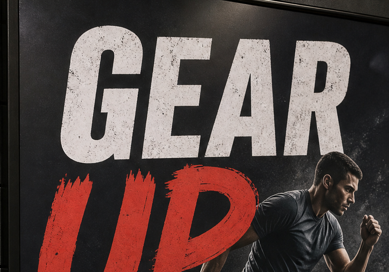
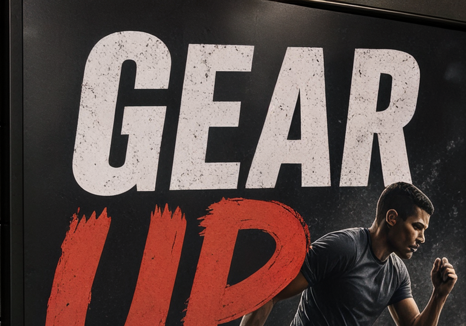
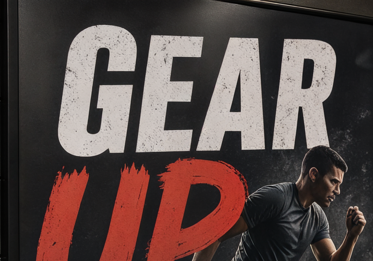

<h1 align="center">Rate-Adaptive One-Step Diffusion Compression for AIGC Images</h1>

<p align="center">
  <b><font size="3">LoViF 2026 AIGC Image Compression Challenge · ECCV 2026 Workshop</font></b>
</p>

<p align="center">
  <a href="https://openreview.net/challenge?redirect=%2Fforum%3Fid%3D41hfEpLx7Z" target="_blank">
    
  </a>
  <a href="https://openreview.net/forum?id=yaLXjEBS7v&noteId=yaLXjEBS7v" target="_blank">
    
  </a>
  <a href="#citation">
    
  </a>
</p>

## Overview

**Abstract**: *We describe our entry to the LoViF 2026 AIGC Image Compression Challenge, a benchmark for ultra-low-bitrate coding of AI-generated images under a strict global rate budget of 0.025 bits per pixel (BPP). Generated imagery poses a distinct challenge for compression: it frequently contains rendered typography, synthetic edges, repeated motifs, UI-like layout, and stylized micro-texture that conventional distortion-oriented codecs erase at this rate, while unconstrained generative decoders can restore plausible-looking detail that no longer matches the source geometry or symbols. We treat this as a rate-perception allocation problem. Our system fine-tunes four rate-specialized checkpoints of the AEIC one-step diffusion codec, generates per-image candidates from all four, including one latent refined through encoder-side test-time optimization (TTO) with periodic entropy-conditioning refresh, entropy-codes every candidate with practical rANS coding, and selects exactly one bitstream per image with a multiple-choice-knapsack MILP solved over true coded file sizes. A fixed, zero-additional-bit residual restoration network is applied at decode time. Every submitted bitstream is independently decodable by the shipped decoder, which uses no source image or external side information. We report the full pipeline, an ablation history spanning 77 logged development experiments, and a set of negative results — including why PSNR could not be pushed to parity with rate-distortion-oriented competitors under this architecture — that we believe are useful to future participants. Our entry scored 31.527739 (PSNR 27.02 dB, MS-SSIM 0.9176, LPIPS 0.0778, DISTS 0.0390 at 0.02495 BPP), the second-best DISTS on the leaderboard, ranking 5th on the organizer-recalculated final test-phase leaderboard announced August 4, 2026.*

## Method

1. **Rate-specialized checkpoint bank**: Four AEIC-ME checkpoints are fine-tuned from the public AEIC-ME lineage with varied loss weights, initialization, and training corpus, covering complementary rate/perception regions instead of four points on one curve. Every checkpoint shares one decoder entry point, so a one-byte identifier in the bitstream reproducibly selects the matching codec at decode time.

2. **Encoder-side latent TTO**: One candidate per image is further refined through test-time optimization of the encoded latent, with periodic entropy-conditioning refresh, before rANS coding. The decoder performs no test-time optimization and never sees the source image.

3. **Global MILP rate allocation**: All raw and TTO-refined candidates are entropy-coded, and a multiple-choice-knapsack MILP selects exactly one real, file-size-measured bitstream per image, subject to the true aggregate bit budget computed from actual coded sizes and image dimensions — not per-image mean-BPP or entropy estimates.

4. **Fixed residual restoration network**: A zero-additional-bit decoder-side restorer is applied uniformly after entropy decode and one-step diffusion reconstruction, contributing a rate-orthogonal quality gain with no bitstream signaling.

## Results

### 1. Official final test-phase leaderboard (top entries, organizer-recalculated, Aug 4, 2026)

| Rank | Team | Score | BPP | PSNR | MS-SSIM | LPIPS | DISTS |
| :--- | :--- | :---: | :---: | :---: | :---: | :---: | :---: |
| 1 | Ashes | 34.004 | 0.02500 | 29.820 | 0.9309 | 0.0763 | 0.0518 |
| 2 | rrrrty | 33.558 | 0.02499 | 28.927 | 0.9345 | 0.0710 | 0.0468 |
| 3 | NeFIC++ | 33.271 | 0.02415 | 28.601 | 0.9322 | 0.0717 | 0.0446 |
| 4 | Freedom | 32.849 | 0.02500 | 28.779 | 0.9333 | 0.0775 | 0.0541 |
| **5** | **Ours (ZeroR)** | **31.528** | **0.02495** | **27.022** | **0.9176** | **0.0778** | **0.0390** |
| 6 | prophet1 | 30.349 | 0.02496 | 26.304 | 0.9082 | 0.0871 | 0.0389 |

Our DISTS (0.0390) is the second-lowest of all ten verified entries, and the lowest among every entry ranked above us; PSNR trails the top four by 1.6–2.8 dB.

### 2. Qualitative results (test image 000009)

Stage-wise reconstruction: source, fine-tuned checkpoint decode, +500-step TTO, +fixed restorer (final submitted bitstream). Bottom row zooms the same poster-text region.

| Source (GT) | Fine-tuned decode | + TTO | + Restorer (final) |
| :---: | :---: | :---: | :---: |
|  |  |  |  |
|  |  |  |  |

### 3. Submission progression (legal-rate, $S$ scale)

| Candidate pool (cumulative) | Score | BPP | Status |
| :--- | :---: | :---: | :--- |
| Early 11-way mixed pool (v3) | 109.94 | 0.0250 | confirmed |
| + expanded fine-tuning, 300-step TTO (v17) | 111.53 | 0.0250 | confirmed |
| + refresh, MILP pool (v20) | 111.66 | 0.0250 | confirmed |
| + 500-step TTO (v21) | 111.83 | 0.0250 | dev-set est. |
| Official organizer-scored archive (test) | **111.53** | 0.0249 | confirmed (test) |

## Installation

```bash
git clone https://github.com/StarAtNyte/aigc-compression-lovif-eccv2026.git
cd aigc-compression-lovif-eccv2026/AEIC
conda create -n aeic python=3.10
conda activate aeic
pip install -r requirements.txt
```

The codec requires a CUDA-capable PyTorch environment plus external SD-Turbo /
AEIC checkpoint downloads; see [`AEIC/README.md`](AEIC/README.md) for the full
environment and download notes.

## Usage

```bash
# Fine-tune a rate-specialized checkpoint
accelerate launch --num_processes=2 --gpu_ids="0,1," src/finetune.py \
  --config="config/finetune_AEIC_ME.yaml" \
  --sd_path="<PATH_TO_SD_TURBO>/sd-turbo" \
  --vae_decoder_path="<PATH_TO_VAE_DECODER>/halfDecoder.ckpt" \
  --train_dataset_2K="<PATH_TO_DATASET>/dataset_2K.hdf5" \
  --test_dataset="<PATH_TO_DATASET>/Kodak" \
  --codec_path="<PATH_TO_CODEC>/AEIC_ME_pretrain_300000.pkl" \
  --output_dir="<PATH_TO_OUTPUT_DIR>"

# Compress a folder of images
python src/compress.py \
  --sd_path="<PATH_TO_SD_TURBO>/sd-turbo" \
  --img_path="<PATH_TO_DATASET>/Kodak" \
  --rec_path="<PATH_TO_SAVE_OUTPUTS>/rec" \
  --bin_path="<PATH_TO_SAVE_OUTPUTS>/bin" \
  --codec_type="AEIC-SE" \
  --codec_path="<PATH_TO_AEIC>/AEIC_SE_ft2.pkl" \
  --vae_decoder_path="<PATH_TO_VAE_DECODER>/halfDecoder.ckpt"

# Evaluate reconstructions against ground truth
python src/evaluate.py \
  --gt_dir="<PATH_TO_DATASET>/Kodak/" \
  --recon_dir="<PATH_TO_SAVE_OUTPUTS>/rec/"
```

Run these from [`AEIC/`](AEIC/); `compress.sh`, `finetune.sh`, `pretrain.sh`,
and `eval_folders.sh` in that directory wrap the same entry points. The
challenge-specific pipeline (checkpoint bank selection, TTO, rANS coding, MILP
rate allocation, restoration) is documented in the paper, not as a single
one-command script.

## Repository contents

- [`AEIC/`](AEIC/) — the AEIC codec and training/inference utilities used by the
  compression pipeline.
- [`paper/`](paper/) — LaTeX source, bibliography, figures, and the final paper PDF.

## Citation

If you find this work useful, please cite:

```bibtex
@inproceedings{khanal2026rateadaptive,
  title     = {Rate-Adaptive One-Step Diffusion Compression for {AIGC} Images},
  author    = {Khanal, Nitiz},
  booktitle = {LoViF 2026 AIGC Image Compression Challenge, ECCV 2026 Workshop},
  year      = {2026},
  url       = {https://openreview.net/forum?id=yaLXjEBS7v}
}
```

## Acknowledgements

We are grateful to the authors of the following repositories, models, and
challenges for making their work publicly available:

1. [AEIC](https://github.com/LuizScarlet/AEIC) ([arXiv:2512.12229](https://arxiv.org/abs/2512.12229)) — the one-step diffusion codec backbone this submission fine-tunes.
2. [SD-Turbo](https://huggingface.co/stabilityai/sd-turbo) — the frozen one-step diffusion prior used for synthesis.
3. [LoViF 2026 AIGC Image Compression Challenge](https://openreview.net/challenge?redirect=%2Fforum%3Fid%3D41hfEpLx7Z) — the challenge this repository was built for.

## License

The bundled AEIC implementation is released under the MIT License; see
[`AEIC/LICENSE`](AEIC/LICENSE). Check the licenses of external checkpoints,
datasets, and third-party dependencies before redistributing them.
